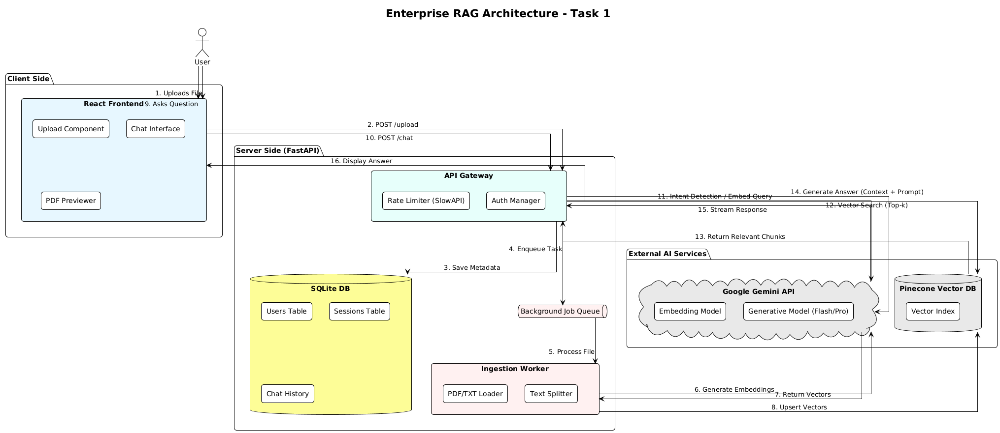

# Enterprise RAG Question Answering System

## 📌 Project Overview
This project is a full-stack **Retrieval-Augmented Generation (RAG)** platform that allows users to chat with their documents (PDF and TXT). It features a robust **FastAPI backend** with background ingestion, rate limiting, and "auto-healing" AI model selection, paired with a responsive **React frontend** for seamless interaction.



## 🚀 Key Features
* **Multi-Format Support:** Upload and chat with **PDF** and **TXT** files.
* **Hybrid Access:** Secure login for saving chat history, plus a **Guest Mode** for instant access without registration.
* **Smart Ingestion:** Uses **Background Tasks** to process large files asynchronously without blocking the UI.
* **Vector Search:** Powered by **Pinecone** and **Google Gemini Embeddings** for high-accuracy context retrieval.
* **Resilient AI:** Implements an **"Auto-Healing"** mechanism that automatically switches between Gemini 2.0, 1.5, and Pro models if one fails or is deprecated.
* **Production Controls:** Includes **Rate Limiting** (SlowAPI) to prevent abuse and **CORS** security.

---

## 🛠️ Tech Stack
* **Frontend:** React, Axios, CSS Modules.
* **Backend:** Python, FastAPI, Uvicorn, SQLAlchemy.
* **Database:** SQLite (User/Session Data), Pinecone (Vector Data).
* **AI Models:** Google Gemini 1.5 Flash / 2.0 Flash (Generative), Gemini Embedding 001.

---

## ⚙️ Setup Instructions

### Prerequisites
* Python 3.9+
* Node.js & npm
* Google Gemini API Key
* Pinecone API Key

### 1. Clone the Repository
```bash
git clone <https://github.com/bryson340/rag-ai-architect.git>
cd rag-chat-project

cd backend

# Create virtual environment
python -m venv venv

# Activate virtual environment
# Windows:
.\venv\Scripts\activate
# Mac/Linux:
source venv/bin/activate

# Install dependencies
pip install -r requirements.txt

GOOGLE_API_KEY=your_google_api_key_here
PINECONE_API_KEY=your_pinecone_api_key_here
PINECONE_INDEX_NAME=your_index_name


cd frontend

# Install dependencies
npm install

# Start the development server
npm run dev

The app will be available at http://localhost:5173

📖 Usage Guide
1. Uploading Documents
Click the "Upload PDF" button on the top right.

Select any .pdf or .txt file.

The system will process the file in the background. Once the "Processing Started" toast appears, you can immediately begin chatting.

2. Chatting
Type your question in the input box (e.g., "Summarize this document").

The system will retrieve the top 5 most relevant chunks from the document and generate an answer.

Citations: Click on the page number chips (e.g., Pg 3) to instantly scroll the PDF viewer to that exact page.

3. Guest vs. User Mode
Guest Mode: Upload and chat immediately. History is lost upon refresh.

User Mode: Click "Login" to create an account. Your chat sessions and document history are saved permanently in the database.

📊 Technical Decisions & Metrics
Chunking Strategy: 1000 characters with 200 overlap to preserve semantic context.

Metric Tracked: Cosine Similarity Score. Chunks with a score < 0.30 are discarded to prevent hallucinations.

Failure Handling: If the primary AI model returns a 404/500 error, the backend automatically retries with a fallback model (e.g., Gemini Pro).

📄 License
This project is open-source and available under the MIT License.